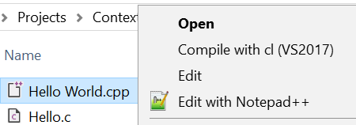

# Context Menu Compile
Context menu (right click) compile for .c/.cpp files in Windows Explorer

### Supports:
Visual Studio 2017 (all versions)

### Usage:
1. Download the repo to a permanent location.
2. Run configure.cmd
3. Import the generated install.reg

